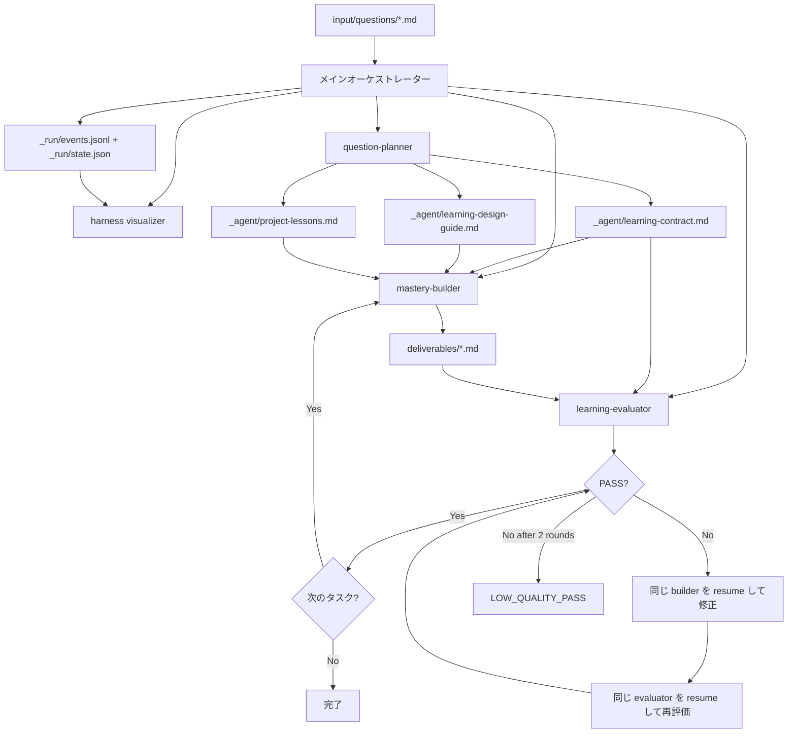

<div align="center">


# SeedX


<a href="https://x.com/CaoYuhaoCarl"></a>


<a href="README.md">🇺🇸 English</a> · <a href="README.zh-CN.md">🇨🇳 简体中文</a> · 🇯🇵 **日本語**

</div>

SeedX（旧 Question-to-Mastery）は、学習質問を入力すると、独立評価済みでそのまま実行できる「習得までの学習パス」を生成するマルチエージェントシステムです。

移行メモ: [SeedX rename with qtm compatibility](docs/release-notes/seedx-rename.md)。



このシステムは、デフォルトでは特定のユーザー、業界、職種、利用シーンに結びつきません。個別化は、入力ファイルに明示された背景、目標、制約からのみ行われます。

---

## クイックスタート

### SeedX と +ask トリガー（推奨）

学習質問の本文をクリップボードにコピーしてから、Claude Code にこう打ちます：

```text
+ask
```

`UserPromptSubmit` hook が自動で：
- `pbpaste` でクリップボード本文を読み取り、`input/questions/question-source-<english-topic>-<timestamp>.md` に保存
- パスと起動指示を注入し、メイン Agent が元の本文を見ない状態でオーケストレーターを開始
- オーケストレーターがこの run の `_run/events.jsonl` + `_run/state.json` を初期化した後に Harness Visualizer を開く

プロジェクト名と出力ディレクトリは同じ English topic + timestamp 形式を使います。例: `output/meme-ai-agent-260509-215509/`。

`+ask <本文>` / `+ask:<本文>` / `+ask：<本文>` を直接送った場合、hook は本文を保存して元メッセージを block します。その後、表示された `+start <path>` を送って起動してください。これにより、メイン Agent が inline 本文を普通の Q&A として回答してしまうのを防ぎます。

### 厳格隔離モード（機密質問向け）

質問に PII、企業秘密が含まれる場合、または「メイン Agent が本文を一切見ない」純度を最大化したい場合：

| トリガー | 振る舞い | UX |
|---|---|---|
| `seedx <本文>` / `seed <本文>` / `sx <本文>` / `用 seedx 调研问题：<本文>` | 保存して直接起動。本文は元のプロンプトに見えたままです | 1 ステップ |
| `+ask`（事前に本文をクリップボードへコピー。本文なし） | `pbpaste` で読み取り、保存して起動 | 1 ステップ |
| `qtm <本文>` / `用 qtm 调研问题：<本文>` / `用 QTM 研究问题:<本文>` | 旧ユーザー向け互換の直接起動。本文は元のプロンプトに見えたままです | 1 ステップ |
| `+ask <本文>` / `+ask:<本文>` / `+ask：<本文>` / `+ask-strict <本文>` | 保存後、元メッセージを block。`+start` 送信後にオーケストレーター起動 | 2 ステップ |
| `+start [path]` | 指定パスまたは最新の質問ファイルから起動 | — |

クリップボードモードは 1 ステップで起動し、本文はメイン Agent の context に入りません。`seedx` / `seed` / `sx` と旧互換の `qtm` は、本文が元メッセージに見えているため直接起動します。inline `+ask` モードは安全な再起動のため先に block します。隔離契約の詳細は [CLAUDE.md §1.2](CLAUDE.md) を参照してください。

### 手動起動（上級）

プロジェクト名や出力ディレクトリを上書きしたい場合は、パス指定のプロンプトも使えます：

```text
学習質問パス: {WORKSPACE_DIR}/input/questions/{question-file}.md
プロジェクト名: {english-topic-yymmdd-HHMMSS}
出力ディレクトリ: {WORKSPACE_DIR}/output/{english-topic-yymmdd-HHMMSS}

現在のワークスペースの CLAUDE.md に厳密に従ってください:
- 現在のワークスペース: {WORKSPACE_DIR}
- 学習質問パスは入力専用です。出力ディレクトリを入力ファイルのあるフォルダに設定しないでください
- すべての生成物を出力ディレクトリに書き込んでください
- デフォルトでは汎用的な学習者視点を維持してください。入力ファイルに明示された背景、目標、シーン、制約だけを learning-contract と成果物に反映できます
- 初期化後、`README.md`、`_run/run-log.md`、`_run/events.jsonl`、`_run/state.json` を作成し、question-planner subagent を起動してください
```

入力例は `input/questions/` にあります。

---

## 実行出力

完全な 1 回の実行では、`output/{english-topic-yymmdd-HHMMSS}/` に次のファイルが生成されます。

```text
output/{english-topic-yymmdd-HHMMSS}/
├── README.md                  # パス索引。質問者はここから読む
├── deliverables/              # 学習者の標準閲覧先
│   ├── question-brief.md
│   ├── domain-map.md
│   ├── learning-path.md
│   ├── exercises.md
│   ├── checkpoints.md
│   ├── application-plan.md
│   └── transfer-plan.md
├── _agent/                    # agent 作業ファイル。標準閲覧先ではない
│   ├── learning-plan.md
│   ├── learning-contract.md
│   ├── learning-design-guide.md
│   ├── project-lessons.md
│   └── review-reports/
│       ├── task01-evaluation.md
│       ├── task02-evaluation.md
│       └── task03-evaluation.md
└── _run/                      # 実行状態と可視化データ
    ├── run-log.md
    ├── events.jsonl
    └── state.json
```

分類ルールは [`docs/specs/output-artifact-layout.md`](docs/specs/output-artifact-layout.md) を参照してください。

---

## 固定タスク単位

| Task | 名前 | Builder の出力 | 評価レポート |
|---|---|---|---|
| task01 | Framing | `deliverables/question-brief.md`, `deliverables/domain-map.md` | `_agent/review-reports/task01-evaluation.md` |
| task02 | Mastery Path | `deliverables/learning-path.md`, `deliverables/exercises.md`, `deliverables/checkpoints.md` | `_agent/review-reports/task02-evaluation.md` |
| task03 | Application & Transfer | `deliverables/application-plan.md`, `deliverables/transfer-plan.md` | `_agent/review-reports/task03-evaluation.md` |

タスクは `task01 → task02 → task03` の固定順で実行されます。各タスクは Build の後に Evaluate されます。PASS なら次のタスクへ進み、FAIL なら最大 2 回の修正ループに入ります。

---

## ディレクトリ構成

```text
.
├── CLAUDE.md                        # メイン Agent のオーケストレーションプロトコル
├── README.md                        # 英語 README、デフォルト
├── README.zh-CN.md                  # 簡体字中国語 README
├── README.ja.md                     # 日本語 README
├── input/questions/                 # 学習質問の入力ファイル
├── output/{english-topic-yymmdd-HHMMSS}/ # 実行出力、プロジェクトごとに分離
├── docs/
│   ├── assets/                      # README とドキュメント用アセット
│   ├── plans/                       # 実装計画
│   ├── roadmap/                     # バージョンロードマップ
│   ├── adr/                         # Architecture Decision Records
│   └── specs/                       # イベントプロトコルとログ形式の仕様
├── tools/
│   ├── harness-visualizer.html      # 単一ファイルの可視化パネル
│   └── open-visualizer.sh           # パネル起動スクリプト
└── .claude/
    ├── agents/
    │   ├── question-planner.md
    │   ├── mastery-builder.md
    │   └── learning-evaluator.md
    └── skills/
        ├── designing-mastery-paths/
        └── reviewing-mastery-paths/
```

---

## Observability 可視化

v0.2 では軽量な観測レイヤーが追加されました。学習成果物の本文は読まず、実行状態だけを表示します。`+ask` / `+start` で起動すると、オーケストレーターがこの run の `_run/events.jsonl` + `_run/state.json` を初期化した後にパネルを開き、パネルがそれらのファイルをポーリングします。

```bash
# 指定プロジェクトの _run/events.jsonl + _run/state.json を読み込み、2 秒ごとに更新するパネルを開く
./tools/open-visualizer.sh {english-topic-yymmdd-HHMMSS}

# プロジェクト名を省略すると、output/ 以下の最新プロジェクトを自動選択
./tools/open-visualizer.sh
```

イベントプロトコルは [docs/specs/harness-observability-events.md](docs/specs/harness-observability-events.md)、ログ形式は [docs/specs/run-log-format.md](docs/specs/run-log-format.md) を参照してください。

---

## 評価基準

`learning-evaluator` は、1 から 5 で採点する 6 次元の rubric を使います。

| 次元 | 説明 |
|---|---|
| Question Quality | 質問が正しく理解され、焦点化されているか |
| Coverage | ドメインの網羅性が十分か |
| Clarity | 表現が明確で理解しやすいか |
| Actionability | 出力をそのまま実行できるか |
| User Context Fit | 個別化が入力ファイルに厳密に基づいているか |
| Transferability | 知識を新しいシーンへ転移できるか |

すべての次元で 4/5 以上が PASS 条件です。追加のハードゲートとして、入力ファイルにない個人、業界、職種の背景を成果物が導入した場合は FAIL になります。

---

## チューニングガイド

**成果物が汎用的すぎる場合:**
1. まず `reviewing-mastery-paths` skill を調整し、Evaluator をより厳密にします。
2. 次に `designing-mastery-paths` skill を調整し、Builder の生成目標をより明確にします。
3. 新しい Agent の追加や Reviewer の分割は最後に検討します。

**成果物が特定のユーザーや業界を誤って仮定している場合:**
1. 入力ファイルがその背景を本当に提供しているか確認します。
2. `_agent/learning-contract.md` の「学習者背景と応用シーン」を確認します。
3. 最後に `reviewing-mastery-paths` の `User Context Fit` ハードゲートを調整します。

各コンポーネントは、複雑性を増やす前に、それ自体が load-bearing であることを示す必要があります。

---

## 設計判断

詳しくは [docs/adr/0001-question-to-mastery-architecture.md](docs/adr/0001-question-to-mastery-architecture.md) を参照してください。
