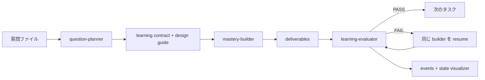

<div align="center">


# SeedX


<a href="README.md">🇺🇸 English</a> · <a href="README.zh-CN.md">🇨🇳 简体中文</a> · 🇯🇵 **日本語**

<p><strong>すべてのアイデアは、ひとつのシステムへと育っていく。</strong></p>

</div>

SeedX は、仕事や学習の中で出てきた問いを、実行可能・評価可能・転用可能な学習パッケージへ変換するマルチエージェントシステムです。

Claude Code、Hermes、OpenClaw、またはモバイルのワークフローから質問を渡せます。SeedX は学習目標を設計し、タスクを分割し、成果物を生成し、独立評価し、弱い部分を修正し、Agent 間の協調、handoff prompt、データフロー、最終成果物を可視化できる形で残します。

## プレビュー


<p align="center"><sub>SeedX の完了済み run：タスク進捗、Agent handoff、イベントタイムライン、生成された学習成果物を同じワークスペースで観測できます。</sub></p>

## なぜ作るのか

SeedX には 2 つの目的があります。

1. 学習者向け：曖昧な問いを、実際に進められる体系的な学習パッケージに変えること。
2. Agent 開発者向け：モデル Agent が harness の中で、人手の介入なしに長い複数ステップの仕事を完了できるかを検証すること。

MiniMax M2.5/M2.7 などの中国発モデル Agent で、harness 下の長時間タスク実行能力を観察するための検証基盤でもあります。

現在の harness は 3 つの制約を中心に設計されています。

- 1 回の実行中に人手の介入を必要としない。
- Agent の協調、prompt、状態、成果物を観測できる。
- すべての学習パッケージは実行可能・評価可能・転用可能である。

## クイックスタート

推奨フロー：

1. 質問本文をクリップボードにコピーします。
2. Claude Code、Hermes、OpenClaw、または接続済みの Agent 入口で送信します。

```text
+ask
```

hook が質問を `input/questions/` に保存し、オーケストレーターを起動し、可視化パネルを開き、最終的な学習パッケージを `output/{english-topic-yymmdd-HHMMSS}/` に書き込みます。

明示的なファイルパスから起動することもできます。

```text
+start input/questions/{question-file}.md
```

次の直接トリガーも互換対応しています。

```text
seedx <質問>
seed <質問>
sx <質問>
qtm <質問>
```

`qtm` は Question-to-Mastery 時代の legacy trigger として引き続き利用できます。

## 何が生成されるか

各 run は `output/` の下にプロジェクトディレクトリを作成します。

```text
output/{project}/
├── README.md
├── deliverables/
│   ├── question-brief.md
│   ├── domain-map.md
│   ├── learning-path.md
│   ├── exercises.md
│   ├── checkpoints.md
│   ├── application-plan.md
│   └── transfer-plan.md
├── _agent/
│   ├── learning-plan.md
│   ├── learning-contract.md
│   ├── learning-design-guide.md
│   ├── project-lessons.md
│   └── review-reports/
└── _run/
    ├── run-log.md
    ├── events.jsonl
    └── state.json
```

学習者が読む中心は `deliverables/` です。Agent の作業メモ、評価レポート、実行状態は `_agent/` と `_run/` に分けて保存されます。

## 仕組み



SeedX は固定された 3 つのタスク単位を実行します。

| Task | 目的 | 成果物 |
|---|---|---|
| `task01` | 問いと領域を整理する | `deliverables/question-brief.md`, `deliverables/domain-map.md` |
| `task02` | 習得パスを作る | `deliverables/learning-path.md`, `deliverables/exercises.md`, `deliverables/checkpoints.md` |
| `task03` | 応用と転用を設計する | `deliverables/application-plan.md`, `deliverables/transfer-plan.md` |

各タスクは生成後に評価されます。FAIL の場合は同じ Builder を resume して修正し、最大 2 ラウンドまで再評価します。

## 可視化

可視化パネルは実行状態だけを読み取り、学習成果物の本文は読みません。

```bash
./tools/open-visualizer.sh {project}
```

プロジェクト名を省略すると、`output/` 以下の最新プロジェクトを開きます。

長時間タスクの実行中に、どの Agent が動いているか、どの prompt が引き渡されたか、どのファイルが生成されたか、各タスクが評価を通過したかを確認できます。

## 高度な使い方

メインオーケストレーターにファイルパスだけを渡したい場合は `+ask` を使います。質問本文が元の chat メッセージに出てもよい場合は、`seedx <質問>` や `qtm <質問>` のような直接トリガーも使えます。

機密性の高い質問では、クリップボードモードを推奨します。

```text
+ask
```

手動で制御したい場合は、まず `input/questions/` に質問ファイルを作成し、次を送信します。

```text
+start input/questions/{question-file}.md
```

## メンテナー向け

- オーケストレーションプロトコル: [AGENTS.md](AGENTS.md)
- Claude Code プロトコルミラー: [CLAUDE.md](CLAUDE.md)
- 出力レイアウト: [docs/specs/output-artifact-layout.md](docs/specs/output-artifact-layout.md)
- イベントプロトコル: [docs/specs/harness-observability-events.md](docs/specs/harness-observability-events.md)
- run log 形式: [docs/specs/run-log-format.md](docs/specs/run-log-format.md)
- リポジトリ衛生ルール: [docs/specs/repository-hygiene.md](docs/specs/repository-hygiene.md)
- アーキテクチャ決定: [docs/adr/0001-question-to-mastery-architecture.md](docs/adr/0001-question-to-mastery-architecture.md)
- SeedX rename note: [docs/release-notes/seedx-rename.md](docs/release-notes/seedx-rename.md)

Contact: X [@CaoYuhaoCarl](https://x.com/CaoYuhaoCarl) · Telegram [@caoyuhaocarl](https://t.me/caoyuhaocarl) · WeChat `caoyuhaocarl`
