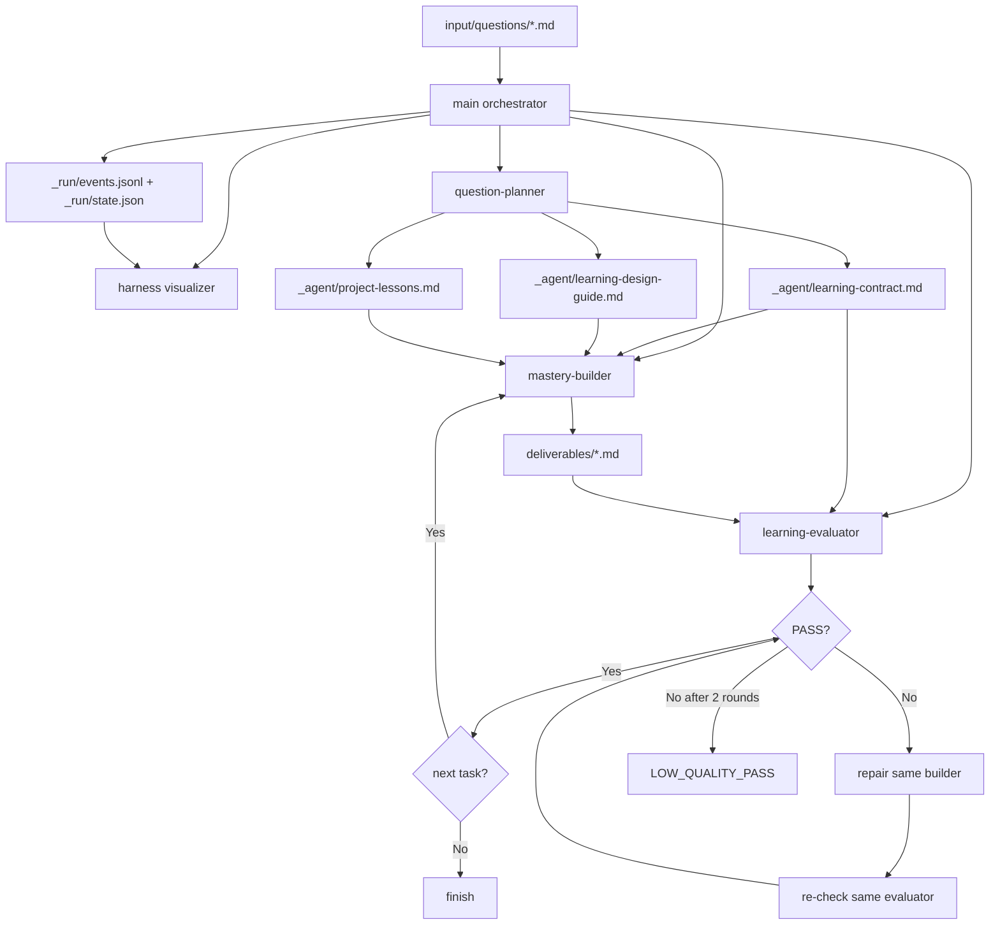

<div align="center">


# SeedX


<a href="https://x.com/CaoYuhaoCarl"></a>


🇺🇸 **English** · <a href="README.zh-CN.md">🇨🇳 简体中文</a> · <a href="README.ja.md">🇯🇵 日本語</a>

</div>

SeedX, formerly Question-to-Mastery, is a multi-agent learning path generation system: give it a learning question, and it produces an independently evaluated, directly executable path toward mastery.

Migration note: [SeedX rename with qtm compatibility](docs/release-notes/seedx-rename.md).



By default, the system is not bound to any specific user, industry, profession, or application scenario. Personalization comes only from the background, goals, and constraints explicitly written in the input file.

---

## Quick Start

### SeedX and +ask triggers (recommended)

Copy the learning question body to your clipboard, then type into Claude Code:

```text
+ask
```

A `UserPromptSubmit` hook will:
- Read the clipboard body via `pbpaste` and save it to `input/questions/question-source-<english-topic>-<timestamp>.md`
- Inject the path and launch instruction so the main agent never sees the original body and starts the orchestrator
- Let the orchestrator open Harness Visualizer after it initializes this run's `_run/events.jsonl` + `_run/state.json`

Project name and output directory use the same English topic + timestamp shape, for example `output/meme-ai-agent-260509-215509/`.

If you send `+ask <body>` / `+ask:<body>` / `+ask：<body>` inline, the hook saves the body and blocks the original message; then follow the shown `+start <path>` prompt. This prevents the main agent from seeing inline text and treating it as a normal Q&A request.

### Strict isolation modes (for sensitive questions)

When the question contains PII, trade secrets, or you want to maximize "main agent never sees the body":

| Trigger | Behavior | UX |
|---|---|---|
| `seedx <body>` / `seed <body>` / `sx <body>` / `用 seedx 调研问题：<body>` | Save and launch directly; the body remains visible in the original prompt | 1 step |
| `+ask` (copy the body to clipboard first; no inline body) | Read via `pbpaste`, save, and launch | 1 step |
| `qtm <body>` / `用 qtm 调研问题：<body>` / `用 QTM 研究问题:<body>` | Legacy-compatible direct launch; the body remains visible in the original prompt | 1 step |
| `+ask <body>` / `+ask:<body>` / `+ask：<body>` / `+ask-strict <body>` | Save and block the original message; orchestrator only starts after you send `+start` | 2 steps |
| `+start [path]` | Launch with explicit path, or the most recent question file | — |

Clipboard mode launches in one step while keeping the body out of the main agent's context. Direct `seedx` / `seed` / `sx` and legacy `qtm` modes launch immediately because the body is already visible in the original user message. Inline `+ask` modes are blocked first for safer follow-up launch. See [CLAUDE.md §1.2](CLAUDE.md) for the isolation contract.

### Manual launch (advanced)

If you want to override the project name or output directory, the path-based prompt still works:

```text
Learning question path: {WORKSPACE_DIR}/input/questions/{question-file}.md
Project name: {english-topic-yymmdd-HHMMSS}
Output directory: {WORKSPACE_DIR}/output/{english-topic-yymmdd-HHMMSS}

Please strictly follow the CLAUDE.md in the current workspace:
- Current workspace: {WORKSPACE_DIR}
- The learning question path is input only; do not set the output directory to the input file's folder
- Write all generated artifacts to the output directory
- Keep the default perspective as a general learner; only background, goals, scenarios, and constraints explicitly provided by the input file may enter the learning contract and artifacts
- After initialization, create `README.md`, `_run/run-log.md`, `_run/events.jsonl`, and `_run/state.json`, then start the question-planner subagent
```

Example input files are available in `input/questions/`.

---

## Run Output

A complete run generates the following under `output/{english-topic-yymmdd-HHMMSS}/`:

```text
output/{english-topic-yymmdd-HHMMSS}/
├── README.md                  # Path index; question askers start here
├── deliverables/              # Default reading path for the learner
│   ├── question-brief.md
│   ├── domain-map.md
│   ├── learning-path.md
│   ├── exercises.md
│   ├── checkpoints.md
│   ├── application-plan.md
│   └── transfer-plan.md
├── _agent/                    # Agent workspace; not the default reading path
│   ├── learning-plan.md
│   ├── learning-contract.md
│   ├── learning-design-guide.md
│   ├── project-lessons.md
│   └── review-reports/
│       ├── task01-evaluation.md
│       ├── task02-evaluation.md
│       └── task03-evaluation.md
└── _run/                      # Runtime state and visualization data
    ├── run-log.md
    ├── events.jsonl
    └── state.json
```

See [`docs/specs/output-artifact-layout.md`](docs/specs/output-artifact-layout.md) for the classification rules.

---

## Fixed Task Units

| Task | Name | Builder outputs | Evaluation report |
|---|---|---|---|
| task01 | Framing | `deliverables/question-brief.md`, `deliverables/domain-map.md` | `_agent/review-reports/task01-evaluation.md` |
| task02 | Mastery Path | `deliverables/learning-path.md`, `deliverables/exercises.md`, `deliverables/checkpoints.md` | `_agent/review-reports/task02-evaluation.md` |
| task03 | Application & Transfer | `deliverables/application-plan.md`, `deliverables/transfer-plan.md` | `_agent/review-reports/task03-evaluation.md` |

Tasks run in the fixed order `task01 → task02 → task03`. Each task is built first, then evaluated. PASS moves to the next task; FAIL enters a repair loop for up to 2 rounds.

---

## Repository Structure

```text
.
├── CLAUDE.md                        # Main agent orchestration protocol
├── README.md                        # English README, default
├── README.zh-CN.md                  # Simplified Chinese README
├── README.ja.md                     # Japanese README
├── input/questions/                 # Learning question input files
├── output/{english-topic-yymmdd-HHMMSS}/ # Run outputs, isolated by project
├── docs/
│   ├── assets/                      # README and documentation assets
│   ├── plans/                       # Implementation plans
│   ├── roadmap/                     # Version roadmap
│   ├── adr/                         # Architecture Decision Records
│   └── specs/                       # Event protocol and log format specs
├── tools/
│   ├── harness-visualizer.html      # Single-file visualization panel
│   ├── open-visualizer.sh           # One-command panel launcher
│   ├── guard-private-config.py      # Commit-time repository hygiene guard
│   └── install-git-hooks.sh         # Local hook installer
├── .githooks/
│   └── pre-commit                   # Runs the repository hygiene guard
└── .claude/
    ├── agents/
    │   ├── question-planner.md
    │   ├── mastery-builder.md
    │   └── learning-evaluator.md
    └── skills/
        ├── designing-mastery-paths/
        └── reviewing-mastery-paths/
```

---

## Observability Visualization

v0.2 adds a lightweight observability layer: it does not read learning artifact bodies, only run state. When you start with `+ask` / `+start`, the orchestrator opens the panel after initializing this run's `_run/events.jsonl` + `_run/state.json`; the panel then polls those files.

```bash
# Open the panel and load _run/events.jsonl + _run/state.json for a project, refreshing every 2 seconds
./tools/open-visualizer.sh {english-topic-yymmdd-HHMMSS}

# Without a project name, automatically choose the newest project under output/
./tools/open-visualizer.sh
```

See [docs/specs/harness-observability-events.md](docs/specs/harness-observability-events.md) for the event protocol and [docs/specs/run-log-format.md](docs/specs/run-log-format.md) for the log format.

Repository hygiene rules live in [docs/specs/repository-hygiene.md](docs/specs/repository-hygiene.md).

---

## Evaluation Criteria

`learning-evaluator` uses a 6-dimension rubric, scored from 1 to 5:

| Dimension | Description |
|---|---|
| Question Quality | Whether the question is correctly understood and focused |
| Coverage | Whether the domain coverage is sufficient |
| Clarity | Whether the output is clear and understandable |
| Actionability | Whether the output can be executed directly |
| User Context Fit | Whether personalization strictly comes from the input file |
| Transferability | Whether the knowledge can transfer to new scenarios |

All dimensions must score at least 4/5 to PASS. Extra hard gate: if an artifact introduces personal, industry, or professional background not provided by the input file, it FAILS.

---

## Tuning Guide

**If artifacts are too generic:**
1. Tune the `reviewing-mastery-paths` skill first so the Evaluator becomes stricter.
2. Then tune the `designing-mastery-paths` skill so the Builder receives sharper generation goals.
3. Only then consider adding a new Agent or splitting the Reviewer.

**If artifacts incorrectly assume a specific user or industry:**
1. Check whether the input file actually provides that background.
2. Check the "learner background and application scenario" section in `_agent/learning-contract.md`.
3. Then tune the `User Context Fit` hard gate in `reviewing-mastery-paths`.

Every component must prove it is load-bearing before the system adds more complexity.

---

## Design Decision

See [docs/adr/0001-question-to-mastery-architecture.md](docs/adr/0001-question-to-mastery-architecture.md).
