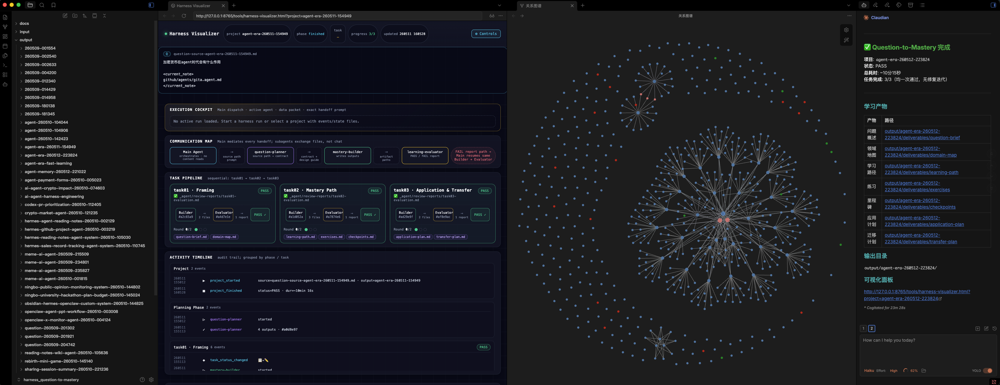
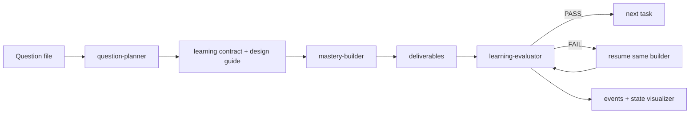

<div align="center">


# SeedX


🇺🇸 **English** · <a href="README.zh-CN.md">🇨🇳 简体中文</a> · <a href="README.ja.md">🇯🇵 日本語</a>

<blockquote>
  <p><em><strong>Every idea can grow into a system.</strong></em></p>
</blockquote>

</div>

SeedX is a multi-agent system that turns a work or learning question into a complete learning package: executable, evaluable, and transferable.

Give it a question from Claude Code, Hermes, OpenClaw, or a mobile workflow. SeedX plans the learning goal, splits the work, builds the artifacts, evaluates them, repairs weak parts, and leaves a visible trail of agent collaboration, prompts, data flow, and outputs.

## Preview



<p align="center"><sub>A completed SeedX run: task progress, agent handoffs, event timeline, and generated learning artifacts stay observable in one workspace.</sub></p>

## Why It Exists

SeedX has two jobs:

1. For learners: convert a messy question into a structured path you can actually follow.
2. For agent builders: test whether model agents can complete long, multi-step work inside a harness without human intervention.

It is also a testbed for long-task runs with Chinese-model agents, including MiniMax M2.5/M2.7 experiments.

The current harness is designed around three constraints:

- No human-in-the-loop during a run.
- Agent collaboration, prompts, state, and artifacts must be visible.
- Every learning package must be executable, evaluable, and transferable.

## Quick Start

Recommended flow:

1. Copy your question body to the clipboard.
2. In Claude Code, Hermes, OpenClaw, or another connected agent entry point, send:

```text
+ask
```

The hook saves the question under `input/questions/`, starts the orchestrator, opens the visualizer, and writes the final learning package under `output/{english-topic-yymmdd-HHMMSS}/`.

You can also start with an explicit file:

```text
+start input/questions/{question-file}.md
```

Legacy and direct triggers are still supported:

```text
seedx <question>
seed <question>
sx <question>
qtm <question>
```

`qtm` remains available as the legacy Question-to-Mastery trigger.

## What You Get

Each run creates a project folder under `output/`:

```text
output/{project}/
├── README.md
├── deliverables/
│   ├── question-brief.md
│   ├── domain-map.md
│   ├── learning-path.md
│   ├── exercises.md
│   ├── checkpoints.md
│   ├── application-plan.md
│   └── transfer-plan.md
├── _agent/
│   ├── learning-plan.md
│   ├── learning-contract.md
│   ├── learning-design-guide.md
│   ├── project-lessons.md
│   └── review-reports/
└── _run/
    ├── run-log.md
    ├── events.jsonl
    └── state.json
```

The learner-facing files are in `deliverables/`. Agent notes, evaluation reports, and runtime state stay in `_agent/` and `_run/`.

## How It Works



SeedX runs three fixed task units:

| Task | Purpose | Outputs |
|---|---|---|
| `task01` | Frame the question | `deliverables/question-brief.md`, `deliverables/domain-map.md` |
| `task02` | Build the mastery path | `deliverables/learning-path.md`, `deliverables/exercises.md`, `deliverables/checkpoints.md` |
| `task03` | Apply and transfer | `deliverables/application-plan.md`, `deliverables/transfer-plan.md` |

Each task is built, evaluated, and repaired for up to two rounds before the system moves on.

## Visualization

The visualizer reads only runtime state, not learning artifact bodies:

```bash
./tools/open-visualizer.sh {project}
```

Without a project name, it opens the newest project under `output/`.

It is useful for inspecting the long-task run: which agent is active, what prompt was handed off, which files were produced, and whether each task passed.

## Advanced Usage

Use `+ask` when you want the main orchestrator to receive only a file path. Use direct triggers like `seedx <question>` or `qtm <question>` when you are fine with the question body appearing in the original chat message.

For sensitive questions, use clipboard mode:

```text
+ask
```

For manually controlled runs, create a question file under `input/questions/`, then start with:

```text
+start input/questions/{question-file}.md
```

## For Maintainers

- Orchestration protocol: [AGENTS.md](AGENTS.md)
- Claude Code protocol mirror: [CLAUDE.md](CLAUDE.md)
- Output layout: [docs/specs/output-artifact-layout.md](docs/specs/output-artifact-layout.md)
- Event protocol: [docs/specs/harness-observability-events.md](docs/specs/harness-observability-events.md)
- Run log format: [docs/specs/run-log-format.md](docs/specs/run-log-format.md)
- Repository hygiene: [docs/specs/repository-hygiene.md](docs/specs/repository-hygiene.md)
- Architecture decision: [docs/adr/0001-question-to-mastery-architecture.md](docs/adr/0001-question-to-mastery-architecture.md)
- SeedX rename note: [docs/release-notes/seedx-rename.md](docs/release-notes/seedx-rename.md)

Contact: [@CaoYuhaoCarl](https://x.com/CaoYuhaoCarl) · Telegram [@caoyuhaocarl](https://t.me/caoyuhaocarl) · WeChat `caoyuhaocarl`
