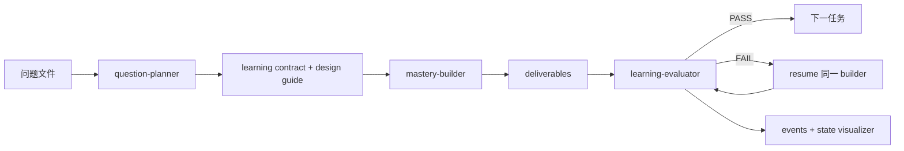

<div align="center">


# SeedX


<a href="README.md">🇺🇸 English</a> · 🇨🇳 **简体中文** · <a href="README.ja.md">🇯🇵 日本語</a>

<p><strong>每颗想法，都能长出一个系统。</strong></p>

</div>

SeedX 是一个多智能体学习方案生成系统：把工作或学习中遇到的问题发给它，它会自动生成一套可执行、可评估、可迁移的系统学习方案。

你可以从 Claude Code、Hermes、OpenClaw 或移动端工作流把问题交给 SeedX。它会规划学习目标、拆分任务、生成产物、独立评估、修复薄弱部分，并把 Agent 协作关系、handoff prompt、数据流和最终产物可视化留下来。

## 效果预览


<p align="center"><sub>一次 SeedX 运行结果：任务进度、Agent 交接、事件流和最终学习产物可以在同一工作区观察。</sub></p>

## 为什么做

SeedX 有两个目标：

1. 面向学习者：把一个模糊问题转成真正能执行的系统学习包。
2. 面向 Agent 构建者：验证模型 Agent 加上 harness 后，能否在无人接管的情况下完成长任务。

它也用于观察 MiniMax M2.5/M2.7 这类国产模型 Agent 在 harness 约束下的长任务执行能力。

当前 harness 围绕三个约束设计：

- 一次运行中不依赖人工接管。
- Agent 协作、prompt、状态和产物必须可观察。
- 每个学习包都必须可执行、可评估、可迁移。

## 快速开始

推荐流程：

1. 把你的问题正文复制到剪贴板。
2. 在 Claude Code、Hermes、OpenClaw 或其他接入的 Agent 入口发送：

```text
+ask
```

hook 会把问题保存到 `input/questions/`，启动主编排器，打开可视化面板，并把最终学习包写入 `output/{english-topic-yymmdd-HHMMSS}/`。

也可以用明确的文件路径启动：

```text
+start input/questions/{question-file}.md
```

兼容以下直接触发方式：

```text
seedx <问题>
seed <问题>
sx <问题>
qtm <问题>
```

`qtm` 是 Question-to-Mastery 时代的 legacy trigger，会继续兼容。

## 会得到什么

每次运行都会在 `output/` 下创建一个项目目录：

```text
output/{project}/
├── README.md
├── deliverables/
│   ├── question-brief.md
│   ├── domain-map.md
│   ├── learning-path.md
│   ├── exercises.md
│   ├── checkpoints.md
│   ├── application-plan.md
│   └── transfer-plan.md
├── _agent/
│   ├── learning-plan.md
│   ├── learning-contract.md
│   ├── learning-design-guide.md
│   ├── project-lessons.md
│   └── review-reports/
└── _run/
    ├── run-log.md
    ├── events.jsonl
    └── state.json
```

学习者主要阅读 `deliverables/`。Agent 工作记录、评估报告和运行状态分别放在 `_agent/` 与 `_run/`。

## 工作方式



SeedX 固定执行三个任务单元：

| Task | 目的 | 产物 |
|---|---|---|
| `task01` | 定义问题与领域地图 | `question-brief.md`, `domain-map.md` |
| `task02` | 生成掌握路径 | `learning-path.md`, `exercises.md`, `checkpoints.md` |
| `task03` | 应用与迁移 | `application-plan.md`, `transfer-plan.md` |

每个任务都会先生成、再评估；如果 FAIL，会 resume 同一个 Builder 修复，最多修复 2 轮后再进入下一步。

## 可视化

可视化面板只读取运行状态，不读取学习产物正文：

```bash
./tools/open-visualizer.sh {project}
```

不传项目名时，会自动打开 `output/` 下最新项目。

它用来观察长任务执行过程：当前哪个 Agent 在工作、交接了什么 prompt、产生了哪些文件、每个任务是否通过评估。

## 高级用法

如果希望主编排器只收到文件路径，使用 `+ask`。如果可以接受问题正文出现在原始 chat 消息里，可以使用 `seedx <问题>` 或 `qtm <问题>` 这类直接触发方式。

处理敏感问题时，优先使用剪贴板模式：

```text
+ask
```

如果想手动控制运行，先在 `input/questions/` 下创建问题文件，再发送：

```text
+start input/questions/{question-file}.md
```

## 维护者入口

- 编排协议：[AGENTS.md](AGENTS.md)
- Claude Code 协议镜像：[CLAUDE.md](CLAUDE.md)
- 输出结构：[docs/specs/output-artifact-layout.md](docs/specs/output-artifact-layout.md)
- 事件协议：[docs/specs/harness-observability-events.md](docs/specs/harness-observability-events.md)
- 运行日志格式：[docs/specs/run-log-format.md](docs/specs/run-log-format.md)
- 仓库卫生规则：[docs/specs/repository-hygiene.md](docs/specs/repository-hygiene.md)
- 架构决策：[docs/adr/0001-question-to-mastery-architecture.md](docs/adr/0001-question-to-mastery-architecture.md)
- SeedX 改名说明：[docs/release-notes/seedx-rename.md](docs/release-notes/seedx-rename.md)

联系：[@CaoYuhaoCarl](https://x.com/CaoYuhaoCarl) · 微信 `caoyuhaocarl`
