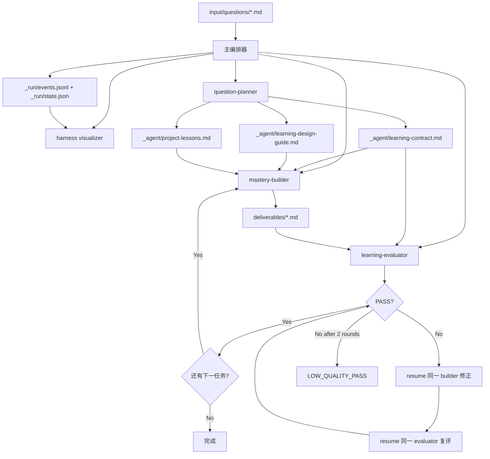

<div align="center">


# Question-to-Mastery


<a href="https://x.com/CaoYuhaoCarl"></a>


<a href="README.md">🇺🇸 English</a> · 🇨🇳 **简体中文** · <a href="README.ja.md">🇯🇵 日本語</a>

</div>

一个多智能体学习路径生成系统：输入一个学习问题，输出一套经过独立评估、可直接执行的学习掌握路径。



系统默认不绑定任何特定用户、行业、职业或应用场景。个性化只来自输入文件中显式写出的背景、目标和约束。

---

## 快速开始

### Slash 触发（推荐）

把学习问题正文复制到剪贴板，然后在 Claude Code 直接发：

```text
+ask
```

`UserPromptSubmit` hook 会自动：
- 通过 `pbpaste` 读取剪贴板正文并落盘到 `input/questions/question-source-<英文主题>-<时间戳>.md`
- 注入路径与启动指令；主 Agent 看不到原始正文，直接进入编排流程
- 由主编排器在初始化本次运行的 `_run/events.jsonl` + `_run/state.json` 后打开 Harness Visualizer

项目名和输出目录使用同样的“英文主题 + 时间戳”形状，例如 `output/meme-ai-agent-260509-215509/`。

如果直接发送 `+ask <正文>` / `+ask:<正文>` / `+ask：<正文>`，hook 会先落盘并 block 原消息；然后按提示发送 `+start <path>` 启动。这样避免主 Agent 看见 inline 正文后把它当普通问答直接回答。

### 严格隔离模式（敏感问题适用）

问题包含 PII、商业机密，或希望最大化"主 Agent 完全看不到正文"的纯度时：

| 触发 | 行为 | UX |
|---|---|---|
| `+ask`（先把正文复制到剪贴板，不带 body） | 通过 `pbpaste` 落盘并启动 | 1 步 |
| `qtm <正文>` / `用 qtm 调研问题：<正文>` / `用 QTM 研究问题:<正文>` | 落盘并直接启动；正文会出现在本轮原始消息中 | 1 步 |
| `+ask <正文>` / `+ask:<正文>` / `+ask：<正文>` / `+ask-strict <正文>` | 落盘并 block 原消息，等用户发 `+start` 启动 | 2 步 |
| `+start [path]` | 启动指定文件或最近落盘的问题文件 | — |

剪贴板模式是一键启动且正文不进入主 Agent context；inline 模式会先 block，因为正文已经出现在原始用户消息中。详见 [CLAUDE.md §1.2](CLAUDE.md)。

### 手动指定（高级）

如果想自定义项目名或输出目录，仍可使用旧式提示：

```text
学习问题路径：{WORKSPACE_DIR}/input/questions/{question-file}.md
项目名：{english-topic-yymmdd-HHMMSS}
输出目录：{WORKSPACE_DIR}/output/{english-topic-yymmdd-HHMMSS}

请严格按当前工作区的 CLAUDE.md 执行：
- 当前工作区：{WORKSPACE_DIR}
- 学习问题路径只作为输入，不得把输出目录设置为输入文件所在文件夹
- 所有生成物写入输出目录
- 默认保持通用学习者视角；只有输入文件显式提供的背景、目标、场景和约束才能进入 learning-contract 与产物
- 初始化后创建 `README.md`、`_run/run-log.md`、`_run/events.jsonl`、`_run/state.json`，然后启动 question-planner subagent
```

示例输入文件见 `input/questions/`。

---

## 运行产出

一次完整运行在 `output/{english-topic-yymmdd-HHMMSS}/` 下生成：

```text
output/{english-topic-yymmdd-HHMMSS}/
├── README.md                  # 路径索引；提问者从这里进入
├── deliverables/              # 提问者/学习者默认阅读
│   ├── question-brief.md
│   ├── domain-map.md
│   ├── learning-path.md
│   ├── exercises.md
│   ├── checkpoints.md
│   ├── application-plan.md
│   └── transfer-plan.md
├── _agent/                    # agent 工作文件；不作为默认阅读路径
│   ├── learning-plan.md
│   ├── learning-contract.md
│   ├── learning-design-guide.md
│   ├── project-lessons.md
│   └── review-reports/
│       ├── task01-evaluation.md
│       ├── task02-evaluation.md
│       └── task03-evaluation.md
└── _run/                      # 运行状态与可视化数据
    ├── run-log.md
    ├── events.jsonl
    └── state.json
```

详细分类规则见 [`docs/specs/output-artifact-layout.md`](docs/specs/output-artifact-layout.md)。

---

## 固定任务单元

| Task | 名称 | Builder 产出 | 评估报告 |
|---|---|---|---|
| task01 | Framing | `deliverables/question-brief.md`, `deliverables/domain-map.md` | `_agent/review-reports/task01-evaluation.md` |
| task02 | Mastery Path | `deliverables/learning-path.md`, `deliverables/exercises.md`, `deliverables/checkpoints.md` | `_agent/review-reports/task02-evaluation.md` |
| task03 | Application & Transfer | `deliverables/application-plan.md`, `deliverables/transfer-plan.md` | `_agent/review-reports/task03-evaluation.md` |

按 `task01 → task02 → task03` 固定顺序执行。每任务先 Build 后 Evaluate；PASS 进入下一任务，FAIL 进入修复循环（最多 2 轮）。

---

## 目录结构

```text
.
├── CLAUDE.md                        # 主 Agent 编排协议
├── README.md                        # 英文 README，默认入口
├── README.zh-CN.md                  # 简体中文 README
├── README.ja.md                     # 日文 README
├── input/questions/                 # 学习问题输入文件
├── output/{english-topic-yymmdd-HHMMSS}/ # 运行产出（按项目隔离）
├── docs/
│   ├── assets/                      # README 和文档资产
│   ├── plans/                       # 实施计划
│   ├── roadmap/                     # 版本路线
│   ├── adr/                         # 架构决策记录 (ADR)
│   └── specs/                       # 事件协议与日志格式规范
├── tools/
│   ├── harness-visualizer.html      # 单文件可视化面板
│   └── open-visualizer.sh           # 一键启动面板脚本
└── .claude/
    ├── agents/
    │   ├── question-planner.md
    │   ├── mastery-builder.md
    │   └── learning-evaluator.md
    └── skills/
        ├── designing-mastery-paths/
        └── reviewing-mastery-paths/
```

---

## Observability 可视化

v0.2 增加的轻量观察层：不读取学习产物正文，只暴露运行状态。通过 `+ask` / `+start` 启动时，主编排器会在初始化本次运行的 `_run/events.jsonl` + `_run/state.json` 后打开可视化面板；面板随后轮询这些文件。

```bash
# 自动打开面板，加载指定项目的 _run/events.jsonl + _run/state.json，每 2 秒刷新
./tools/open-visualizer.sh {english-topic-yymmdd-HHMMSS}

# 不指定项目名时，自动选择 output/ 下最新项目
./tools/open-visualizer.sh
```

事件协议见 [docs/specs/harness-observability-events.md](docs/specs/harness-observability-events.md)，日志格式见 [docs/specs/run-log-format.md](docs/specs/run-log-format.md)。

---

## 评估标准

`learning-evaluator` 使用 6 维 rubric（每维 1-5 分）：

| 维度 | 说明 |
|---|---|
| Question Quality | 问题是否被正确理解和聚焦 |
| Coverage | 领域覆盖是否充分 |
| Clarity | 表达是否清晰可理解 |
| Actionability | 产出是否可直接执行 |
| User Context Fit | 个性化是否严格来自输入文件 |
| Transferability | 知识是否可迁移到新场景 |

所有维度 ≥ 4/5 才能 PASS。额外硬门槛：产物引入输入文件中未提供的个人/行业/职业背景 → FAIL。

---

## 调优指南

**产物太泛：**
1. 先调 `reviewing-mastery-paths` skill，让 Evaluator 更挑剔。
2. 再调 `designing-mastery-paths` skill，让 Builder 生成目标更明确。
3. 最后才考虑增加新 Agent 或拆分 Reviewer。

**产物错误绑定了特定用户/行业：**
1. 先检查输入文件是否确实提供了该背景。
2. 再检查 `_agent/learning-contract.md` 的"学习者背景与应用场景"。
3. 最后调 `reviewing-mastery-paths` 的 `User Context Fit` 硬门槛。

每个组件必须证明自己是 load-bearing，否则不增加复杂度。

---

## 设计决策

详见 [docs/adr/0001-question-to-mastery-architecture.md](docs/adr/0001-question-to-mastery-architecture.md)。
